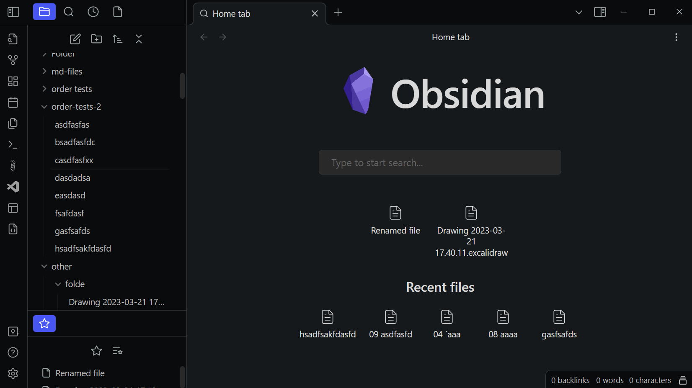
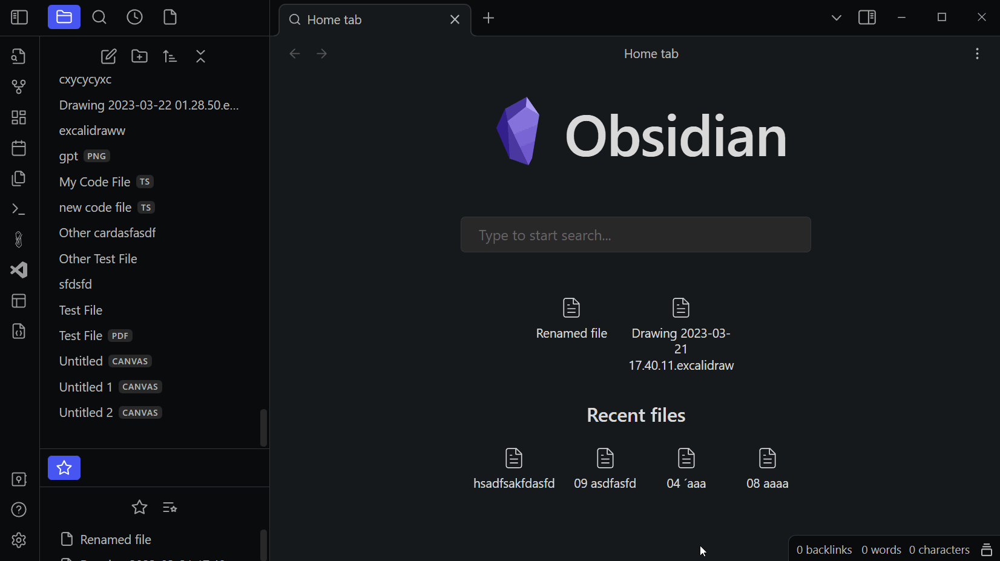

# obsidian-file-order

> Obsidian 插件：用文件名中的数字前缀定义自定义排序，并在文件浏览器中通过拖拽更新该排序。

> 构建工具：Node.js ≥ 22（运行单元测试的 `--experimental-strip-types` 需要 **Node ≥ 22.6**），使用 **npm** 作为包管理器。推荐版本由仓库根目录 `.nvmrc` 锁定（当前 `24.20.0`）。





## 功能特性

- **数字前缀排序**：为文件夹/文件加上 `01 标题.md` 这样的数字前缀，即可让 Obsidian 按你的意图排序，而不是默认的字母序。
- **拖拽调整顺序**：在排序对话框中直接拖拽条目，插件会自动重写所有数字前缀，保持顺序连续。
- **引用自动更新**：重命名时使用 Obsidian 的 `renameFile`，被排序文件的所有 wiki 链接与嵌入引用会自动同步更新。
- **配置自动推断**：再次打开同一文件夹的排序对话框时，插件会从文件名中自动推断出前缀位数、分隔符与起始编号。插件**不保存任何文件夹级设置**，排序信息全部存在于文件名本身——即使卸载插件，排序依然生效；也能读取并编辑以前手动创建的排序。
- **防误操作保护**：
  - 未做任何改动时点「应用更改」，不会剥除已有前缀，也不会给无前缀的文件强加前缀；
  - 只有当你**拖动了顺序**，无前缀文件才会被自动加上前缀；
  - 排序时自动跳过被忽略的文件（见下方「忽略规则」）。
- **冲突预检**：应用前会检查目标文件名是否与本次待改名项或未改名的兄弟文件冲突，冲突时中止并提示，不会把文件夹改到一半。
- **移动端可用**：`isDesktopOnly: false`，内置 `process` polyfill 与触控拖拽传感器，支持 iOS/Android 端 Obsidian。

## 安装

### 方式一：社区插件市场

如果插件已上架社区插件列表，可直接在「设置 → 第三方插件 → 社区插件 → 浏览」中搜索 **File Order**（插件 id：`obsidian-file-order`）安装。

### 方式二：手动安装

1. 从发布页（或构建产物）获取以下三个文件：`main.js`、`manifest.json`、`styles.css`；
2. 在你的 Obsidian 库中创建目录 `<库路径>/.obsidian/plugins/obsidian-file-order/`；
3. 将三个文件放入该目录；
4. 在「设置 → 第三方插件」中启用 **File Order**。

### 方式三：本地构建安装

见下方「开发与贡献」的 `npm run build:all` 用法，构建后会自动复制到指定库的插件目录。

## 使用方法

### 快速上手

假设想在文件夹 `第一章` 里让笔记按你想要的顺序排列，文件当前叫：
```
第一章/
  B 引言.md
  A 结论.md
```
1. 在文件浏览器中**右键** `第一章`（或其中的任一文件）；
2. 点击 **重新排序**，弹出排序对话框（含"文件夹"/"文件"两组）；
3. 直接**拖拽**条目，把 `B 引言` 放到 `A 结论` 前面；
4. 点击 **应用更改**。文件会按新的先后顺序重命名并保持连续编号：
   ```
   B 引言.md   →   0 B 引言.md
   A 结论.md   →   1 A 结论.md
   ```
   （编号从「起始编号」开始，默认 `0`；前缀位数会随条目总数自动调整，如 12 个条目时自动使用 2 位。）
5. 若不满意，可点 **撤销更改** 回到打开时的状态，或点 **清除自定义排序** 移除所有数字前缀、恢复默认排序。

> 插件不会修改正文，只重命名文件；对已有双向链接/wiki 引用的文件，重命名后 Obsidian 会自动同步引用。

### 排序对话框

在文件浏览器中**右键任意文件或文件夹**，点击 **重新排序**，即可打开该文件夹的排序对话框。对话框包含两组条目：

- **文件夹**：文件夹排序；
- **文件**：文件排序。

拖拽条目即可调整顺序，点击 **应用更改** 应用更改。每组标题旁有 3 个按钮：

| 按钮 | 作用 |
| --- | --- |
| **撤销更改** | 撤销本次拖拽与配置修改，恢复打开对话框时的状态 |
| **清除自定义排序** | 清除该文件夹的自定义排序：移除所有数字前缀，恢复为 Obsidian 默认排序（顺序按名称排序） |
| **下拉箭头** | 展开/收起该组的排序配置（见下） |

展开后的配置项（可**按文件夹单独调整**）：

- **前缀最小长度**：数字前缀不足该位数时补零，如 `001` 而非 `1`；设 `0` 表示按实际位数。
- **分隔符**：前缀与标题之间的分隔符，默认是单个空格，可以是任意字符（如 `-`、`_`、`.`，也支持多个字符）。
- **起始编号**：第一个条目的前缀数字，默认 `0`。

### 右键修复名称

在文件浏览器中右键一个**不符合排序规范**的文件（如新拖入的无前缀文件），菜单中会出现 **按排序规范修复名称**。点击后插件会按该文件夹的排序规范（推断出的前缀位数、分隔符）为文件补上正确的编号，编号取「当前最大编号 + 1」，跳过已有编号的间隙，不会与现有文件冲突。

### 命令面板

打开命令面板（`Ctrl/Cmd + P`），执行 **重新排序根目录条目** 可对仓库根目录进行排序。

### 插件设置

「设置 → 第三方插件 → obsidian-file-order」提供以下默认值设置，它们用作某个文件夹**首次**整理时的默认值；之后该文件夹会沿用自身的配置（可在排序对话框中按文件夹单独调整）：

| 设置项 | 说明 |
| --- | --- |
| 前缀数字最小长度 | 默认补零位数，`0` 表示按实际位数 |
| 分隔符 | 默认分隔符（多个空格时以 `[N 个空格]` 显示） |
| 起始编号 | 默认起始编号（≥ 0） |
| 忽略规则 | 正则表达式，匹配的文件/文件夹不参与排序。例如 `^index\.md$` 忽略 `index.md`，`^\.` 忽略所有点开头的隐藏文件。输入时会校验规则：**非法**或**过于复杂**（易触发灾难性回溯、可能卡顿）的表达式都会被拒绝 |
| 忽略同名文件夹说明文件 | 开启后，文件夹 `MyFolderName` 下的同名说明文件 `MyFolderName.md` 会被自动忽略（Obsidian 的文件夹说明文件惯例） |

## 排序机制说明

- 一个条目形如 `<数字前缀><分隔符><名称>`，例如 `01 第一章.md`、`02 第二章.md`。
- 打开排序对话框时，插件从当前文件名推断三项配置：前缀位数（是否补零）、分隔符、起始编号；推断失败（如文件夹无数字前缀）则回退到插件设置里的默认值。
- 应用排序时按当前列表顺序重新生成连续编号：`起始编号, 起始编号+1, ...`；前缀位数至少能容纳条目总数（如 12 个条目自动使用 2 位）。
- 所有排序信息都保存在文件名中，插件不保存文件夹级状态；清空排序只需点击 **清除自定义排序**。

## 常见问题 (FAQ)

**Q1：拖动条目并点击「应用更改」后，为什么提示"目标名称已存在"？**
这是**冲突预检**：插件在重命名前会检查目标文件名是否与本次待改名项或未改名的文件冲突（例如被忽略文件占用、或两个条目最终都叫同一个名字）。冲突时插件会中止并提示，不会把文件夹改到一半。请检查同名文件或调整顺序后重试。

**Q2：输入"忽略规则"时为什么保存不了，提示"过于复杂"？**
插件会拒绝**易触发灾难性回溯（ReDoS）**的正则，如 `^(a+)+$`。这类正则可能在匹配文件名时卡死 Obsidian。请把规则改写得更简单（例如避免嵌套重复）。

**Q3：没拖动、只打开对话框又点「应用更改」，会破坏原名吗？**
不会。插件只在**顺序发生改变**时才重写前缀；若顺序未变且无需补零，则保持原名——**不剥除已有前缀，也不会给无前缀文件强加前缀**（防误操作保护）。

**Q4：`01.md`、`02.md` 这类纯数字文件名能正常排序吗？**
支持（v1.0.0+）。这类文件名去掉前缀后标题相同，插件会比较**完整文件名**而非剥离后的标题来判断是否发生拖拽，因此排序可靠。

**Q5：出现以 `__fileorder_tmp_` 开头的文件是怎么回事？**
当两个文件**交换顺序**（A→B、B→A）时，插件会用临时名腾出目标槽位再改名，属于正常内部过程，正常情况下会自动还原到位。若因异常中断或历史版本残留了这类文件，可手动删除；若频繁出现，请查看控制台中的 `[obsidian-file-order]` 日志。

**Q6：移动端如何拖拽排序？**
长按条目约 150ms 后即可拖拽，松开完成排序。若感觉不灵敏，可检查手机上的触控手势与其它插件是否冲突。

## 兼容性

- 最低 Obsidian 版本：`0.15.0`
- 桌面端与移动端均支持（`isDesktopOnly: false`）
- 依赖：React 18 + @dnd-kit（拖拽）

## 开发与贡献

前置要求：Node.js ≥ 22（运行 `npm test` 需要 **Node ≥ 22.6**，因为用到 `--experimental-strip-types`），使用 **npm** 作为包管理器。仓库根目录的 `.nvmrc` 锁定推荐版本（当前 `24.20.0`）。

安装依赖：

```bash
npm install
```

### 一键构建（推荐）

项目提供 Node ESM 脚本 `scripts/build.mjs`（注册为 `build:all`），自动完成「安装依赖 → 构建 → 校验产物」，直接跨平台（Windows/Linux/macOS）运行，无需额外安装 bash：

```bash
npm run build:all                 # 安装依赖并构建到 dist/
npm run build:all -- /path/to/vault   # 构建后自动复制到该 Obsidian 库的插件目录
```

复制后即可在 Obsidian 的「设置 → 第三方插件」中启用 **File Order**（无需手动拷贝文件）。脚本会校验 `dist/{main.js,manifest.json,styles.css}` 是否存在并输出大小，任一缺失即报错。

### 开发模式

以 watch 模式构建插件：

```bash
npm run dev
```

> 若尚未安装 hot-reload-plugin，系统会提示你。需要先在你的 Obsidian 仓库中启用该插件，热重载才会生效；可能需要刷新插件列表才会显示。

### 测试

运行单元测试（纯 Node 环境，零额外依赖，覆盖核心排序逻辑 32 个用例，含重命名、排序推断、正则安全等）：

```bash
npm test
# 等价于: node --experimental-strip-types --test tests/*.test.ts
```

### 代码检查与类型检查

```bash
npm run lint       # ESLint 检查 src/
npm run lint:fix   # 自动修复
npm run typecheck  # 类型检查（tsc --noEmit，纯检查不产出文件）
```

### 发布

推荐通过 GitHub Actions **自动发布**（详见下方「自动发布（GitHub Actions）」）。旧的手动方式：

```bash
npm run release    # 通过 publish-fast 发布（含 lint + build 预检）
```

发布产物（`dist/main.js`、`dist/manifest.json`、`dist/styles.css`）由 `releaseAssets: "dist/*"` 指定；版本号通过 `version-bump.mjs` 同步到 `manifest.json` 与 `versions.json`。

### 自动发布（GitHub Actions）

项目提供 `.github/workflows/release.yml`，支持**推送 `v*` 标签自动发版**或**手动触发**，自动完成版本校验、构建、ZIP 打包与 GitHub Release 发布：

1. 本地升级版本并同步：
   ```bash
   npm version patch|minor|major   # postversion 自动同步 manifest/versions 并构建
   git push                        # 推送代码
   ```
2. **推 tag 自动发版**（推荐）：推送 `v<版本号>` 标签即自动触发发布；若手动触发已先发布同版本，会经幂等检查直接跳过，不会重复发布。
   ```bash
   git tag v<版本号> && git push origin v<版本号>
   ```
   也可在 GitHub 仓库页进入 **Actions → Release → Run workflow** 手动触发（无需填写任何参数）。
3. 工作流会自动：
   - 解析版本（tag 触发取 tag，手动触发取 `package.json`，并校验版本格式、与 `manifest.json`/`package.json` 一致）；
   - 幂等判定：对应 Release 已存在则整体跳过构建与发布；
   - 发布前校验（tag 触发时额外启用）：`versions.json` 含该版本映射、tag 不得落后于默认分支最新提交（防陈旧标签误发）；
   - 门禁：`lint` + `typecheck` + `test` 通过后构建；
   - 产出 ZIP `obsidian-file-order-<版本号>.zip`，内含 `obsidian-file-order/` 子目录（解压后把该目录放入 `.obsidian/plugins/` 即可）；
   - 创建 GitHub Release，Release notes 自动生成为自上版以来的提交摘要。

Node 版本由仓库根目录 `.nvmrc` 锁定，Actions 通过 `node-version-file` 读取，与本地保持一致。

## 项目结构

```
src/
  main.ts                     # 插件入口：注册右键菜单、命令、设置页
  fileOrder.ts                # Plugin 主类：加载设置、注册事件
  settings.ts                 # 设置类型与默认值
  fileOrderSettingTab.ts      # 插件设置页（中文）
  process-polyfill.ts         # 移动端 process polyfill
  fileOrderDialog/            # 「重新排序」对话框子模块（React）
    fileOrderModal.tsx        # 对话框宿主：React 挂载/卸载、冲突预检、批量重命名
    fileOrderDialog.tsx       # 对话框组件：文件夹/文件两组排序列表
    fileOrderDragBox.tsx      # dnd-kit 拖拽列表
    fileOrderDragBoxConfig.tsx # 展开的排序配置项
    useFileOrderDragBox.ts    # 拖拽状态与名称重算逻辑
    fileOrderItem.tsx         # 列表条目 UI
    utils.ts                  # 核心纯函数：解析/生成/推断/修复名称
  styles.css                  # 对话框样式
tests/
  utils.test.ts               # 纯函数单元测试（32 用例，零依赖）
scripts/
  build.mjs                   # 一键构建脚本（Node ESM，跨平台）
```

## 致谢

- 项目脚手架由 [create-obsidian-plugin](https://www.npmjs.com/package/create-obsidian-plugin) 生成；
- 拖拽排序使用 [@dnd-kit](https://dndkit.com/)。

## 许可证

[MIT](LICENSE)
